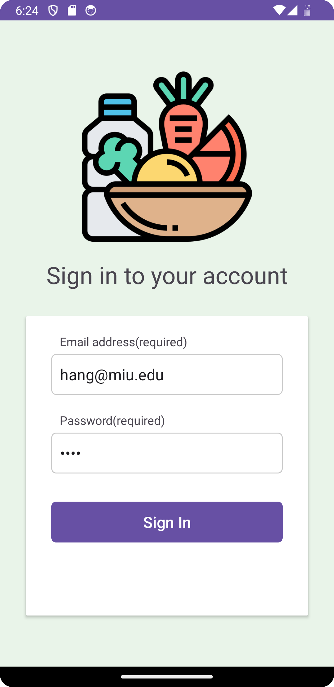

# Mobile Device Programing

# Screenshots

<h2>Lesson 7</h2>

Screenshot login         | 
:-------------------------:
 

Screenshot recipes
:-------------------------:|:-------------------------:
 | 

Screenshot mealPlanner
:-------------------------:|:-------------------------:
 |  

Screenshot blogs
:-------------------------:|:-------------------------:|:-------------------------:
 |  | 

Screenshot contact
:-------------------------:
 

Screenshot aboutMe
:-------------------------:|:-------------------------:
 | 
